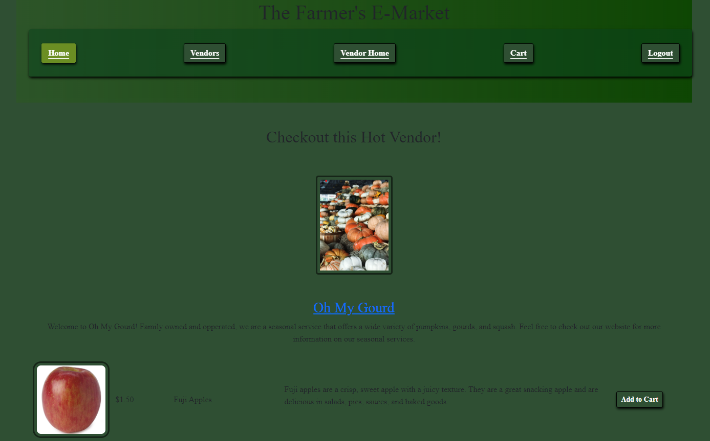

# Title: farmersMarket-proj2

# Table of Contents:

- [Description](#description)
- [Installation](#installation)
- [Usage](#usage)
- [Contributions](#contributions)
- [Questions](#questions)

## Description

-Market website where vendors can sell their products, and buyers can purchase those products.
-NOT SECURE PAYMENT METHOD (sends emails reciept to user and vendor)
-Create Users, Vendors, Products, and checkout from a cart.

## Installation

Install mysql.
Install node js.
Copy the code from github.
open server file in terminal.
run npm i make sure you have all the packages you need. listed in the package.json file.
create a .env file with appropriate values - DB_NAME = ""
-DB_USER = ""
-DB_PASSWORD=""
-SESSION_SECRET=
-e_username=''
-e_password=
-oauth_client_id=
-oauth_client_secret=
-oauth_redirect_uri=
-refresh_token =

## Usage

-Create a user or vendor.
-Add Items to a cart.
-Edit items in your cart
-Checkout.
-if vendor
-create products
-view sales data
-update business info

## Contributions

Class assignments, bing ai to help with understanding some concepts (mainly what bootsrap CAN do)

Authors: Rob, Tiffany, Jacob

## Questions

https://github.com/lilcobby/farmersMarket-proj2

## Heroku link

https://farmersmarket-6a75e85eecc8.herokuapp.com/

